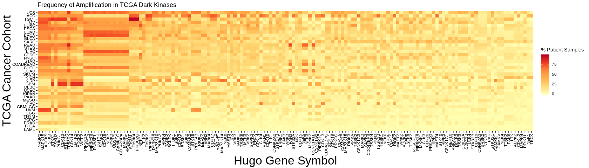
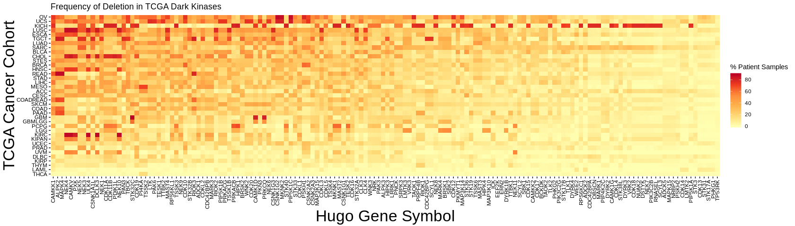

TCGA Kinase CNV Analysis
================

Data Collection/Loading
-----------------------

This notebook assumes that you have already run the kinase\_CNV\_download.Rmd document and successfully collected the kinase\_CNV.rds file.

``` r
#check if a data file has been made with these results, if so, go ahead and load
#it, otherwise WARNING!
if (file.exists(here('CNV_analysis','data','kinase_CNV.rds'))) {
  kinase_CNV = read_rds(here('CNV_analysis','data','kinase_CNV.rds'))
} else {
  warning("Couldn't find the kinase_CNV.rds file, did you run the kinase_CNV_download document?")
}
```

Data Organization/Analysis
--------------------------

The MAF data is organized to indicate each individual mutation call made in for each kinase in each tumor sample. Let's get a count of how often each kinase is mutated in each patient and summarize that as a percent.

``` r
#Get the number of samples for each cohort and filter down to only the tumor
#samples, i.e. not the normal paired samples
sample_counts = Metadata.Counts(format='csv') %>% filter(sample_type == "Tumor")

kinase_CNV_freq = kinase_CNV %>%
  #This command fills out blank entires for each combonation of cohort and
  #Hugo_symbol, useful for the later plotting steps
  complete(cohort,gene) %>%
  group_by(cohort,gene) %>%
  
  #The cn_alteration column contains the call whether or not an amplication (>
  #0) or deletion (< 0) has occurred
  summarise(Amplified_count = sum(cn_alteration > 0),
            Deletion_count = sum(cn_alteration < 0)) %>%
  
  #Collect the cohort counts into the same data structure
  left_join(sample_counts %>% select(cohort,cn)) %>%
  
  #Calculate percentages of amp/deletion
  mutate(freq_amplification = 100*(Amplified_count/cn),
         freq_deletion = 100*(Deletion_count/cn)) %>%
  
  #Add column with the light/dark classification
  left_join(DarkKinaseTools::all_kinases %>% select(symbol,class),
            by=c("gene"="symbol")) %>%
  
  #remove and rename columns for cleanup
  select(-ends_with('_count'),-matches('cn')) %>%
  rename(gene_id = gene)
```

    ## Joining, by = "cohort"

    ## Warning: Column `gene`/`symbol` joining character vector and factor,
    ## coercing into character vector

``` r
readr::write_csv(kinase_CNV_freq,here('CNV_analysis','data','kinase_CNV_rates.csv'))

synLogin()
```

    ## Welcome, Matthew Berginski!

    ## NULL

``` r
synStore(File(path=here('CNV_analysis','data','kinase_CNV_rates.csv'), parent='syn13363433'))
```

    ## ################################################## Uploading file to Synapse storage ##################################################
    Uploading [####################]100.00%   942.7kB/942.7kB  kinase_CNV_rates.csv Done...

    ## File: kinase_CNV_rates.csv (syn13363445)
    ##   md5=bbee36bc3c4bb1c5edd6f915d0e1d29b
    ##   fileSize=965284
    ##   contentType=text/csv
    ##   externalURL=None
    ##   cacheDir=/home/mbergins/Documents/Projects/TCGA_Kinase_Analysis/CNV_analysis/data
    ##   files=['kinase_CNV_rates.csv']
    ##   path=/home/mbergins/Documents/Projects/TCGA_Kinase_Analysis/CNV_analysis/data/kinase_CNV_rates.csv
    ##   synapseStore=True
    ## properties:
    ##   accessControlList=/repo/v1/entity/syn13363445/acl
    ##   annotations=/repo/v1/entity/syn13363445/annotations
    ##   concreteType=org.sagebionetworks.repo.model.FileEntity
    ##   createdBy=3366786
    ##   createdOn=2018-07-12T20:26:25.070Z
    ##   dataFileHandleId=28714319
    ##   entityType=org.sagebionetworks.repo.model.FileEntity
    ##   etag=81b4bb4e-9314-443c-8506-ea248a483d5f
    ##   id=syn13363445
    ##   modifiedBy=3366786
    ##   modifiedOn=2018-07-20T20:46:16.986Z
    ##   name=kinase_CNV_rates.csv
    ##   parentId=syn13363433
    ##   uri=/repo/v1/entity/syn13363445
    ##   versionLabel=2
    ##   versionNumber=2
    ##   versionUrl=/repo/v1/entity/syn13363445/version/2
    ##   versions=/repo/v1/entity/syn13363445/version
    ## annotations:

Data Visualization
------------------

Let's start the data analysis with some heatmaps of the frequency of various types of mutation present in the dark kinases.

### Amplification

``` r
dark_mutation_freq = kinase_CNV_freq %>% filter(class=="Dark")

kinase_sort_order = dark_mutation_freq %>%
  group_by(gene_id) %>%
  summarise(average_mutation = mean(freq_amplification)) %>%
  arrange(desc(average_mutation))

cohort_sort_order = dark_mutation_freq %>%
  group_by(cohort) %>%
  summarise(average_mutation = mean(freq_amplification)) %>%
  arrange(average_mutation)

ggplot(dark_mutation_freq,aes(x=gene_id,y=cohort,fill=freq_amplification)) + 
  geom_tile() + 
  scale_fill_distiller(direction=1,palette = 'YlOrRd') + 
  scale_x_discrete(limits=kinase_sort_order$gene_id) +
  scale_y_discrete(limits=cohort_sort_order$cohort) +
  theme_berginski() +
  theme(axis.text.x = element_text(angle = 90, hjust = 1, vjust=0.5),
        axis.title = element_text(size=25)) +
  ggtitle("Frequency of Amplification in TCGA Dark Kinases") +
  labs(x='Hugo Gene Symbol',y='TCGA Cancer Cohort',fill="% Patient Samples")
```



### Deletion

``` r
dark_mutation_freq = kinase_CNV_freq %>% filter(class=="Dark")

kinase_sort_order = dark_mutation_freq %>%
  group_by(gene_id) %>%
  summarise(average_mutation = mean(freq_deletion)) %>%
  arrange(desc(average_mutation))

cohort_sort_order = dark_mutation_freq %>%
  group_by(cohort) %>%
  summarise(average_mutation = mean(freq_deletion)) %>%
  arrange(average_mutation)

ggplot(dark_mutation_freq,aes(x=gene_id,y=cohort,fill=freq_deletion)) + 
  geom_tile() + 
  scale_fill_distiller(direction=1,palette = 'YlOrRd') + 
  scale_x_discrete(limits=kinase_sort_order$gene_id) +
  scale_y_discrete(limits=cohort_sort_order$cohort) +
  theme_berginski() +
  theme(axis.text.x = element_text(angle = 90, hjust = 1, vjust=0.5),
        axis.title = element_text(size=25)) +
  ggtitle("Frequency of Deletion in TCGA Dark Kinases") +
  labs(x='Hugo Gene Symbol',y='TCGA Cancer Cohort',fill="% Patient Samples")
```


